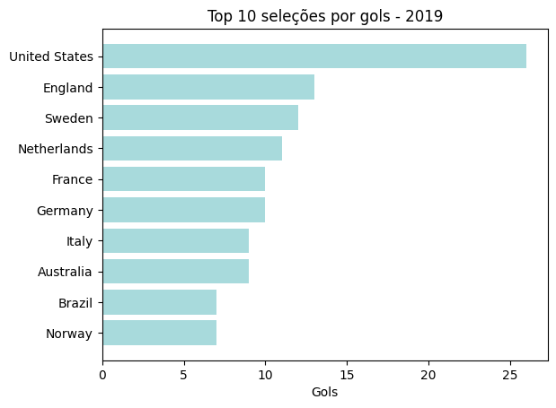
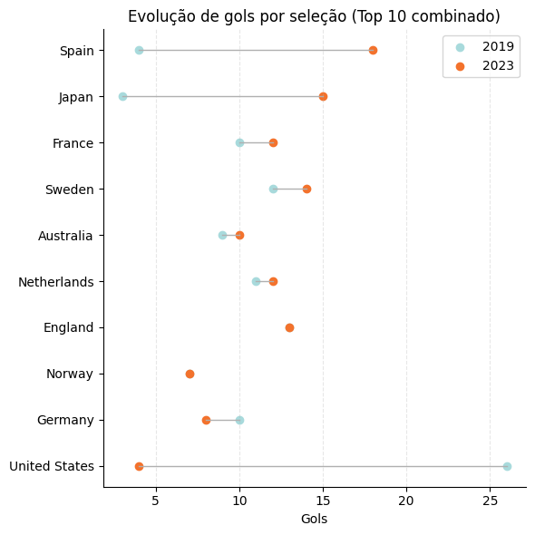
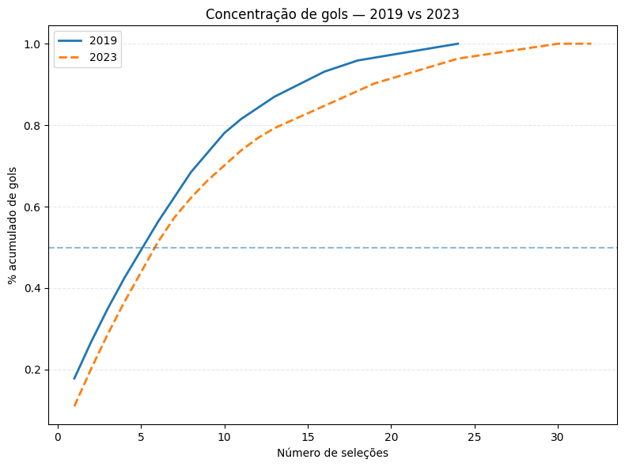
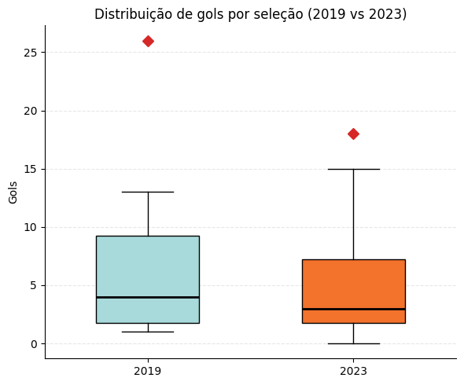

# ⚽ Goal Distribution — Women's World Cup (2019 vs 2023)

This project analyzes how goals are distributed among teams in the FIFA Women’s World Cup, comparing 2019 and 2023 editions.

The focus is on:
- Top scoring teams
- Changes between editions
- Goal concentration

## 📈 Key Insights

- The top 3 teams scored:
  - **34.9%** of goals in 2019  
  - **28.7%** in 2023  

👉 Goal concentration decreased, suggesting a more balanced tournament.

## 📊 Visualizations

### Top Teams

### Changes Between Editions

### Goal Concentration

### Distribution

## 📦 Data

- Match-level data (JSON format)
- Transformed into team-level goal totals

## 🧮 Methodology

1. Data extraction from nested JSON
2. Transformation (wide → long format)
3. Aggregation by team
4. Ranking and concentration analysis

## 🔗 Related Article

Read the full analysis on Medium: [link]
